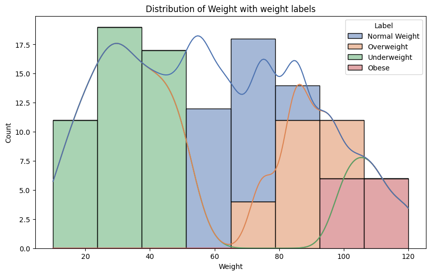

# Laporan Proyek Machine Learning

### Nama : Alan Hermawan

### Nim : 211351010

### Kelas : Malam B

## Domain Proyek

Web app ini berfungsi untuk memberikan klasifikasi berat badan berdasarkan informasi yang dinputkan, pengguna dapat memperoleh hasil klasifikasi yang mencakup kategori seperti Kekurangan berat badan, Berat Badan Normal, Kelebihan Berat Badan, dan Obesitas sehingga dapat menjadikan evaluasi untuk gaya hidup kedepannya.

## Business Understanding

Web app ini memungkinkan pengguna untuk memantau dan mengevaluasi status berat badan mereka sendiri. Ini mendorong kesadaran akan kesehatan dan potensial untuk perubahan gaya hidup yang lebih sehat.

### Problem Statements

Banyak individu mengalami kesulitan dalam menilai status berat badan mereka dengan akurat.

### Solution statements

Mengatasi kesulitan tersebut dengan menyediakan alat yang dapat memberikan klasifikasi berat badan yang lebih tepat berdasarkan data yang diinputkan.

### Goals

Mengembangkan web app yang memberikan klasifikasi berat badan yang akurat berdasarkan informasi yang diinputkan.

## Dat understanding

Dataset ini berisi informasi tentang klasifikasi obesitas pada individu-individu tertentu. Data ini dikumpulkan dari berbagai sumber, termasuk catatan medis, survei, dan data yang dilaporkan sendiri oleh individu. Dataset ini memiliki baris sebanyak 108 dan 7 kolom.

[Obesity Classification Dataset](https://www.kaggle.com/datasets/sujithmandala/obesity-classification-dataset)

### Variabel-variabel pada Obesity Classification Dataset adalah sebagai berikut:

-   ID: Kode unik yang digunakan untuk membedakan satu individu dengan individu lainnya.
-   Age: Usia dari seseorang. int64 (11 - 112)
-   Gender: Jenis kelamin. object (Male, Female)
-   Height: Tinggi badan diukur dalam satuan cm. int64 (120 - 210)
-   Weight: Berat badan diukur dalam satuan kg. int64 (10 - 120)
-   BMI: Indeks massa tubuh yang dihitung dengan membagi berat badan dengan kuadrat tinggi badan. float64 (3.9 - 37.2)
-   Label: Klasifikasi obesitas, yang bisa salah satu dari kategori. object (Normal, Weight, Overweight, Obese, Underweight)

## Data Preparation

Pertama upload file kaggle agar bisa mendownload dataset dari kaggle

```py
from google.colab import files
files.upload()
```

Buat folder untuk menyimpan file kaggle

```py
!mkdir -p ~/.kaggle
!cp kaggle.json ~/.kaggle/
!chmod 600 ~/.kaggle/kaggle.json
!ls ~/.kaggle
```

Download datasetnya

```py
!kaggle datasets download -d sujithmandala/obesity-classification-dataset
```

Extract file zip hasil download diatas

```py
!mkdir obesity
!unzip obesity-classification-dataset.zip -d obesity
!ls obesity
```

### Import library

Import libaray yang akan digunakan

```py
import pandas as pd
import numpy as np
import matplotlib.pyplot as plt
import seaborn as sns

from sklearn.model_selection import train_test_split
from sklearn.neighbors import KNeighborsClassifier
from sklearn import metrics
from sklearn.metrics import classification_report

import plotly.graph_objs as go
import plotly.offline as py
import pickle

from sklearn import neighbors
from mlxtend.plotting import plot_decision_regions
import matplotlib.pyplot as plt

import warnings
warnings.filterwarnings('ignore')
```

### Data discovery

Membuat variabel dataframe

```py
df = pd.read_csv('/content/obesity/Obesity Classification.csv')
```

Lihat 5 data dalam dataframe

```
df.head()
```

Melihat bentuk dataframe, dataframe ini memiliki 108 baris dan 7 kolom

```py
df.shape
```

Melihat rangkuman data numerik

```py
df.describe()
```

Melihat apakah ada data null

```py
df.isnull().sum().sort_values(ascending=False)
```

Menghitung jumlah kemunculan setiap nilai di kolom 'Label'

```py
df.value_counts('Label')
```

### EDA

Kita lihat distribusi dari kolom label dan gender dengan melihat persentase nya

```py
fig, axs = plt.subplots(1, 2, figsize=(12, 5))

axs[0].pie(df['Label'].value_counts(), labels=df['Label'].value_counts().index, autopct='%.0f%%')
axs[0].set_title('Distribution by Label')

axs[1].pie(df['Gender'].value_counts(), labels=df['Gender'].value_counts().index, autopct='%.0f%%')
axs[1].set_title('Distribution by Gender')

plt.tight_layout()
plt.show()
```


Data ini memilki lebih banyak orang-orang dengan klasifikasi underweight dan sedikit orang yang obesitas

Lalu kita lihat distribusi dari umur dengan klasifikasi berat badan

```py
plt.figure(figsize=(10,6),dpi=100)
sns.histplot(data=df,x='Age',kde=True,hue='Label',multiple='stack',palette='deep')
plt.title('Distribution of Age with weight labels')
```


Semua penderita obesitas berusia 40 tahun ke atas.

Selanjutnya distribusi dari berat badan

```py
plt.figure(figsize=(10,6),dpi=100)
sns.histplot(data=df,x='Weight',kde=True,hue='Label',multiple='stack',palette='deep')
plt.title('Distribution of Weight with weight labels');
```



Ya dapat kita lihat orang-orang dengan obesitas memiliki berat badan mendekati atau lebih dari 100 kg

Selanjutnya melihat dari distribusi tinggi badan

```py
plt.figure(figsize=(10,6),dpi=100)
sns.histplot(data=df,x='Height',kde=True,hue='Label',multiple='stack',palette='deep')
plt.title('Distribution of Height with weight labels');
```


Untuk tinggi badan terlihat orang yang obesitas berada
diantara mendekati atau lebih dari 200 cm

Kita lihat dari distribusi jenis kelamin

```py
plt.figure(figsize=(10,6),dpi=100)
sns.histplot(data=df,x='Gender',kde=True,hue='Label',multiple='stack',palette='deep')
plt.title('Distribution of Gender with weight labels');
```


Dapat kita lihat pada data kita orang-orang dengan obesitas hanya berjenis kelamin laki-laki saja

Distribusi berdasarkan BMI


Distribusi diatas menunjukan orang-orang dengan BMI kurang dari 20 memiliki berat badan yang kurang dan orang-orang dengan 30 BMI memilki obesitas

Selanjutnya melihat heatmap korelasi kolom dengan label tetapi kita harus mengubah data object menjadi numerik terlebih dahulu

```py
df=df.replace({'Gender':{'Male': 1, 'Female': 2}})
df=df.replace({'Label':{'Underweight': 1, 'Normal Weight': 2, 'Overweight': 3, 'Obese': 4}})
```

```py
sns.heatmap(df.corr()[['Label']].sort_values(by='Label', ascending=False), vmin=-1, vmax=1, annot=True, cmap='GnBu')
```


## Modeling

Membuat variabel X yaitu feature dari semua kolom yang ada kecuali Label dan membuat y yaitu label yang berisi data Kolom Label

```
X = df.drop('Label', axis=1)
y = df['Label']
```

Selanjutnya split data dan mencari nilai test_scores dan train_score terbaik

```py
X_train,X_test,y_train,y_test = train_test_split(X,y,test_size=0.3,random_state=2)

test_scores = []
train_scores = []

for i in range(1,15):

    knn = KNeighborsClassifier(i)
    knn.fit(X_train,y_train)

    train_scores.append(knn.score(X_train,y_train))
    test_scores.append(knn.score(X_test,y_test))
```

```py
max_train_score = max(train_scores)
train_scores_ind = [i for i, v in enumerate(train_scores) if v == max_train_score]
print('Max train score {} % and k = {}'.format(max_train_score*100,list(map(lambda x: x+1, train_scores_ind))))
```

Kita mendapatkan max score 100.0 % pada data train pada k = 1

```py
max_test_score = max(test_scores)
test_scores_ind = [i for i, v in enumerate(test_scores) if v == max_test_score]
print('Max test score {} % and k = {}'.format(max_test_score*100,list(map(lambda x: x+1, test_scores_ind))))
```

berbeda dengan train score pada test score max score yang kita dapatkan yaitu 96.96 % pada k = 5

Selanjutnya kita membuat model dengan menggunakan k 5

```py
knn = KNeighborsClassifier(5)

knn.fit(X_train,y_train)
knn.score(X_test,y_test)
```

dan hasil scorenya 96.96 % sama dengan yang kita dapatkan pada test max score

## Visuliasasi hasil algortima

Pertama kita buat prediksi dari model yang telah kita buat pada sebelumnya

```py
y_pred = knn.predict(X_test)

input_data = (25,1,175,80,25)

input_data_as_numpy_array = np.array(input_data)

input_data_reshaped = input_data_as_numpy_array.reshape(1,-1)

prediction = knn.predict(input_data_reshaped)
print(prediction)

if (prediction[0]==1):
  print('Kekurangan Berat Badan')
elif (prediction[0] == 2):
        print('Berat Badan Normal')
elif (prediction[0] == 3):
        print('Kelebihan Berat Badan')
else:
  print('Obesitas')
```

Outputnya adalah Berat Badan Normal yang dimana sesuai dengan data aktualnya

Selanjutnya melihat decision region knn dari weight dan height

```py
fig, ax = plt.subplots(figsize=(10, 5))
x = df[['Weight', 'Height']].values
y = df['Label'].astype(int).values
clf = neighbors.KNeighborsClassifier(n_neighbors=5)
clf.fit(x, y)

plot_decision_regions(x, y, clf=clf, legend=2, ax=ax)
ax.set_xlabel('Weight')
ax.set_ylabel('Height')
ax.set_title('Knn dengan K=5')
plt.show()
```


## Save model

```py
filename = 'Obesity Classification.pkl'
with open(filename, 'wb') as file:
    pickle.dump(knn, file)
```

```py
filename = 'model.sav'
pickle.dump(knn, open(filename, 'wb'))
```

## Evaluation

Pada tahap ini saya menggunakan confusion matrix dan classification sebagai matrix evaluasi nya

```py
    cnf_matrix = metrics.confusion_matrix(y_test, y_pred)
    p = sns.heatmap(pd.DataFrame(cnf_matrix), annot=True, cmap="YlGnBu" ,fmt='g')
    plt.title('Confusion matrix', y=1.1)
    plt.ylabel('Actual label')
    plt.xlabel('Predicted label')
```


Dapat kita lihat hanya ada 1 data yang tidak sesuai dengan actual nya dimana harusnya 3 pada prediksi hasilnya 2

Untuk hasil classification_report nya kita memiliki hasil yang cukup bagus

```py
print(classification_report(y_test,y_pred))
```


## Deployment
[Obesity Prediction App](https://obesity-prediction-alan.streamlit.app/) <br>

